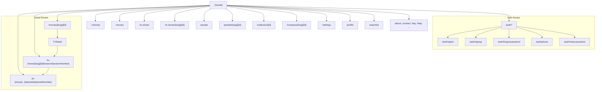
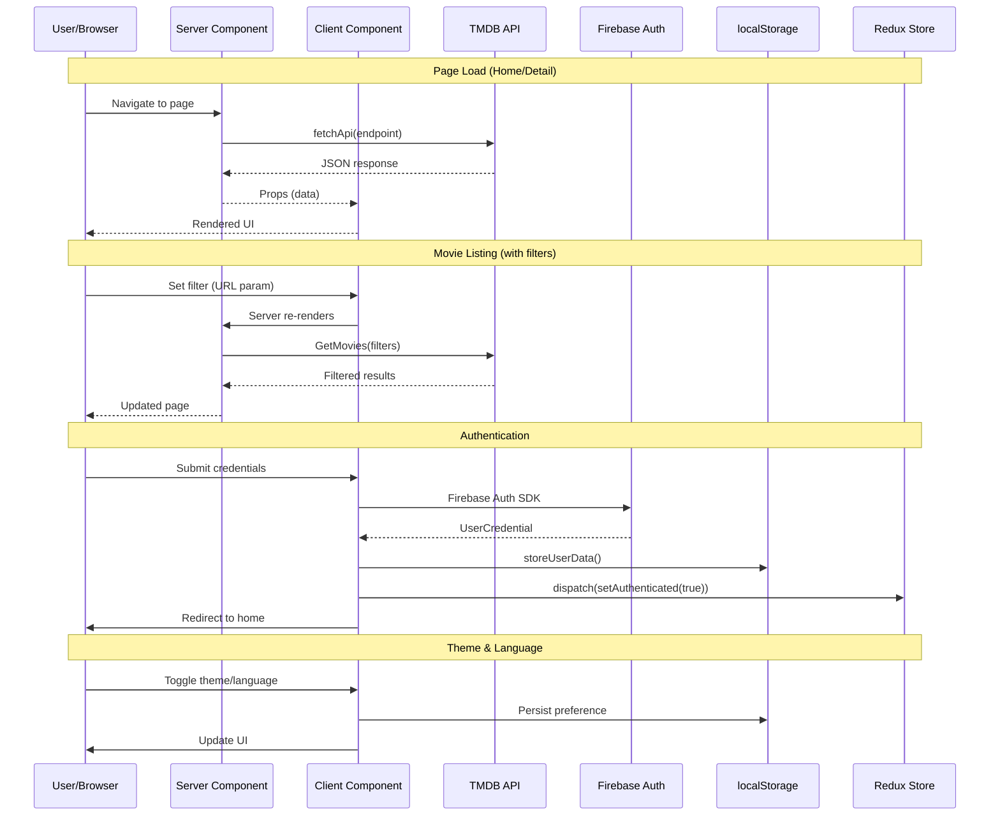

# SmartStream

An IMDb-inspired movie and TV show discovery platform built with Next.js. Browse thousands of movies, TV shows, and actors with rich detail pages, filtering, internationalization, and Firebase authentication.

---

## Tech Stack

| Category | Technology |
|----------|-----------|
| **Framework** | Next.js 16.2.9 (App Router) |
| **Language** | TypeScript 5 |
| **Styling** | Tailwind CSS v4 + `tw-animate-css` |
| **UI Primitives** | shadcn/ui (radix-nova style) + Radix UI |
| **State Management** | Redux Toolkit + React Redux |
| **Internationalization** | next-intl (English / Arabic) |
| **Authentication** | Firebase Auth (email/password, Google, phone, anonymous) |
| **Data Fetching** | Native `fetch` (Server Components) + Axios (client) |
| **HTTP Client** | Axios |
| **Carousels** | Swiper 12 |
| **Animations** | Motion (Framer Motion) |
| **Forms** | react-hook-form |
| **Icons** | Lucide React |
| **Phone Input** | react-phone-number-input |
| **CSS Utilities** | clsx, tailwind-merge, class-variance-authority |
| **Fonts** | Roboto (Google Fonts via `next/font`) |
| **Linting** | ESLint 9 (flat config) with `eslint-config-next` |
| **Package Manager** | npm |

---

## Project Structure

```
src/
├── app/                          # Next.js App Router pages & layouts
│   ├── [locale]/                 # Localized routes (en, ar)
│   │   ├── layout.tsx            # Root layout (Header, Footer, providers)
│   │   ├── page.tsx              # Home page
│   │   ├── globals.css           # Global styles, design tokens, Tailwind config
│   │   ├── about/                # About page
│   │   ├── auth/                 # Auth pages (signin, signup, forgot-password, reset-password, phone)
│   │   ├── careers/              # Careers page
│   │   ├── collection/           # Movie collection detail page
│   │   ├── company/              # Production company detail page
│   │   ├── contact/              # Contact page
│   │   ├── cookies/              # Cookies policy
│   │   ├── faq/                  # FAQ page
│   │   ├── favorites/            # Favorites page (Firestore)
│   │   ├── feedback/             # Feedback page
│   │   ├── guidelines/           # Community guidelines
│   │   ├── help/                 # Help center
│   │   ├── movies/               # Movies listing + detail pages
│   │   ├── people/               # People listing (placeholder) + detail
│   │   ├── press/                # Press page
│   │   ├── privacy/              # Privacy policy
│   │   ├── profile/              # User profile
│   │   ├── search/               # Search page (placeholder)
│   │   ├── settings/             # User settings
│   │   ├── subscription/         # Subscription/pricing page
│   │   ├── terms/                # Terms of service
│   │   ├── tv-shows/             # TV shows listing + detail + season + episode pages
│   │   └── watchlist/            # Watchlist page (Firestore)
│   └── favicon.ico
│
├── features/                     # Feature-based modules
│   ├── auth/                     # Authentication feature
│   │   ├── components/           # Auth UI (forms, layouts, providers)
│   │   ├── hooks/                # Auth hooks (login, register, Google, phone, guest, etc.)
│   │   ├── services/             # Firebase initialization
│   │   └── store/                # Redux auth slice
│   │
│   ├── movies/                   # Movies feature
│   │   ├── components/
│   │   │   ├── listing/          # Home page sections, cards, hero banner
│   │   │   ├── detail/           # Movie detail components (hero, info, cast, etc.)
│   │   │   └── filters/          # Movie search filters (genre, language, year, etc.)
│   │   └── services/             # Axios-based TMDB movie fetch
│   │
│   ├── tv/                       # TV show detail components
│   │   ├── components/
│   │   │   ├── detail/           # TV show detail (header, seasons, sidebar)
│   │   │   ├── season/           # Season detail pages
│   │   │   └── episode/          # Episode detail pages
│   │   └── services/             # (empty)
│   │
│   ├── tv-shows/                 # TV shows listing feature
│   │   ├── components/
│   │   │   ├── listing/          # (empty - placeholder)
│   │   │   └── filters/          # (empty - placeholder)
│   │   ├── constants/            # (empty)
│   │   ├── hooks/                # (empty)
│   │   ├── services/             # (empty)
│   │   └── types/                # (empty)
│   │
│   ├── person/                   # Person/actor detail components
│   │   └── components/           # Person hero, credits, photos, sidebar
│   │
│   ├── collection/               # Movie collection components
│   │   └── components/           # Collection hero, content, sidebar
│   │
│   ├── company/                  # Production company components
│   │   └── components/           # Company hero, overview, portfolio, media, links
│   │
│   ├── settings/                 # User settings feature
│   │   ├── components/           # Settings sections (account, preferences, playback, etc.)
│   │   ├── hooks/                # (empty)
│   │   └── settings-page.tsx     # Settings page orchestrator
│   │
│   ├── home/                     # (empty - reserved)
│   │   ├── components/           # (empty)
│   │   └── hooks/                # (empty)
│   │
│   ├── profile/                  # (empty - reserved)
│   │   ├── hooks/                # (empty)
│   │   ├── services/             # (empty)
│   │   └── types/                # (empty)
│   │
│   ├── favorites/                # Favorites feature
│   │   ├── components/           # Favorites grid
│   │   └── hooks/                # Firestore fetch, delete all
│   │
│   ├── watchlist/                # Watchlist feature
│   │   ├── components/           # Watchlist grid
│   │   └── hooks/                # Firestore fetch, delete all
│   │
│   └── episode/                  # (empty - reserved)
│       └── components/           # (empty)
│
├── shared/                       # Shared resources
│   ├── components/
│   │   ├── layout/               # Header, Footer, NavLinks, SearchBar, UserMenu, Logo, Copyright
│   │   ├── ui/                   # shadcn/ui components (Button, Card, Input, Select, etc.)
│   │   ├── skeletons/            # Loading skeletons for movies, TV, people, grids
│   │   ├── pagination/           # PaginationDemo component
│   │   └── theme/                # Custom ThemeProvider (light/dark/system)
│   │
│   ├── hooks/                    # Shared hooks
│   │   ├── useChangePage.ts      # URL-based pagination hook
│   │   └── useResetFilters.ts    # Filter reset hook
│   │
│   ├── services/                 # Shared API services
│   │   └── fetchApi.ts           # Generic TMDB fetch function (Server Components)
│   │
│   ├── store/                    # Redux store configuration
│   │   └── store.ts              # Configured store with auth reducer
│   │
│   ├── provider/                 # React providers
│   │   └── reduxProvider.tsx     # Redux Provider wrapper
│   │
│   ├── types/                    # TypeScript type definitions
│   │   ├── tmdb.ts               # Complete TMDB API type definitions
│   │   └── index.tsx             # (empty barrel)
│   │
│   └── utils/                    # Utility functions
│       ├── utils.ts              # cn() class merging utility
│       ├── slugify.ts            # URL slug generation
│       └── pagination.ts         # Page number calculation
│
├── i18n/                         # Internationalization
│   ├── routing.ts                # Locale routing config (en, ar)
│   ├── request.ts                # Message loader by locale
│   └── navigation.ts             # i18n-aware navigation helpers
│
├── messages/                     # Translation files
│   ├── en.json                   # English translations
│   └── ar.json                   # Arabic translations
│
└── proxy.ts                      # next-intl middleware (matcher config)
```

---

## Architecture

### Pattern: Hybrid Server & Client Components

SmartStream uses Next.js App Router with a **hybrid rendering architecture**:

```
┌─────────────────────────────────────────────────────┐
│                    NEXT.JS 16                        │
│                                                      │
│  ┌─────────────────┐      ┌──────────────────────┐  │
│  │ Server Components│ ───► │  Client Components   │  │
│  │ (RSC)            │      │  ("use client")      │  │
│  │                  │      │                      │  │
│  │ • Data fetching  │      │ • Interactivity      │  │
│  │ • SEO metadata   │      │ • Event handlers     │  │
│  │ • Initial render │      │ • State/effects      │  │
│  │ • Skeleton UI    │      │ • Animations         │  │
│  └──────┬───────────┘      └──────────┬───────────┘  │
│         │                             │              │
│         ▼                             ▼              │
│  ┌──────────────────────────────────────────────┐   │
│  │              TMDB API (external)              │   │
│  └──────────────────────────────────────────────┘   │
│                                                      │
│  ┌──────────────────────────────────────────────┐   │
│  │              Firebase Auth                     │   │
│  └──────────────────────────────────────────────┘   │
└─────────────────────────────────────────────────────┘
```

### Key Architectural Decisions

1. **Feature-based folder structure** — Each feature (auth, movies, tv, etc.) encapsulates its own components, hooks, services, and state, keeping the codebase modular and scalable.

2. **Server Components for data fetching** — TMDB data is fetched in Server Components using `fetchApi()` and passed as props to Client Components, improving performance and SEO.

3. **Client Components only when needed** — Interactive elements (forms, animations, carousels, theme toggle) use the `"use client"` directive. Static content remains as Server Components.

4. **Centralized API layer** — `fetchApi()` in `shared/services` provides a consistent interface for all TMDB API calls with caching and revalidation support.

5. **Internationalization-first routing** — All routes are under `[locale]` with next-intl handling locale detection, redirection, and message loading.

6. **Design token system** — All visual properties are CSS variables using OKLCH color space, enabling seamless light/dark mode switching.

---

## Features

### Authentication

| Aspect | Details |
|--------|---------|
| **Purpose** | User registration, login, and account management |
| **Pages** | `/auth/signin`, `/auth/signup`, `/auth/forgot-password`, `/auth/phone`, `/auth/reset-password` |
| **Components** | `SignInForm`, `SignUpForm`, `ForgotPasswordForm`, `ResetPasswordForm`, `PhoneAuth`, `GoogleAuth`, `GuestAuth`, `EmailPasswordAuth`, `AuthProviders`, `AuthLayout`, `AuthDivider`, `AuthStatusMessage` |
| **Services** | `firebase.ts` — Firebase app initialization with config from env vars |
| **Hooks** | `useLogin`, `useRegister`, `useGoogleAuth`, `usePhoneAuth`, `useGuestLogin`, `useForgotPassword`, `useResetPassword`, `saveUserToLocalStorage` |
| **State** | Redux `authSlice` — stores `isAuthenticated` boolean |
| **API** | Firebase Auth SDK (no custom backend) |

**Auth Flow:**
```
User → Auth Page → Firebase SDK → Store user in localStorage → Update Redux state → Redirect to home
```

Authentication methods:
- Email/Password registration and login
- Google OAuth (popup)
- Phone number (OTP via SMS with reCAPTCHA)
- Anonymous/guest login

User data is stored in `localStorage` under the key `user_data`. The `authSlice` Redux reducer tracks only the `isAuthenticated` boolean flag.

### Home Page

| Aspect | Details |
|--------|---------|
| **Purpose** | Content discovery landing page |
| **Pages** | `/` |
| **Components** | `HeroSection`, `HomeSections`, `HeroBanner`, `HeroSlide`, `FeaturedRow`, `PremiumRow`, `BannerSection`, `MediaRow`, `MovieCard`, `TvCard`, `PersonCard`, `SectionHeader` |
| **Services** | `fetchApi` — fetches trending/popular/top-rated movies, TV shows, and people |
| **State** | None (server-rendered data) |

The home page displays multiple curated sections:
1. **Hero Banner** — Trending movies with auto-rotating full-screen backdrop
2. **Popular Movies** — Featured spotlight + carousel
3. **Top Rated Movies** — Premium editorial row
4. **Now Playing** — Banner section
5. **Production Companies** — Static company/showcase section
6. **Trending TV** — Carousel
7. **Popular TV** — Carousel
8. **Airing Today** — Banner section
9. **Popular Actors** — Person card carousel

### Movies Listing

| Aspect | Details |
|--------|---------|
| **Purpose** | Browse and filter movie catalog |
| **Pages** | `/movies` |
| **Components** | `DesktopFilters`, `MobileBar`, `MovieCard`, `PaginationDemo` |
| **Services** | `GetMovies` — Axios-based TMDB discover endpoint with filter params |
| **Hooks** | `useChangePage`, `useResetFilters` |
| **State** | URL search params (no Redux) |

Filters: Genre, Language, Year, Rating, Country, Sort (popularity, rating, release date, revenue), Adult content toggle.

### Movie Detail

| Aspect | Details |
|--------|---------|
| **Purpose** | Comprehensive movie information page |
| **Pages** | `/movies/[slug]/[id]` |
| **Components** | `MovieHero`, `MovieInfo`, `MovieActions`, `MovieBackground`, `MovieCollection`, `MovieMainContent`, `MovieSidebarColumn`, `MovieCast`, `MovieCrew`, `MovieReviews`, `MovieVideos`, `MovieRating`, `MoviePhotos`, `MovieOverview`, `MovieProductionCompanies`, `MovieReleaseDates`, `MovieAlternativeTitles`, `MovieExternalLinks`, `MovieWatchProviders`, `MovieLists`, `RelatedMovies`, `FullCastSlider`, `CastCard`, `CrewCard`, `FadeIn`, `GenreTags`, `MovieDetailSkeleton` |
| **Services** | `fetchApi` with `append_to_response` (14 included endpoints) |

The movie detail page fetches the movie with all related data in a single TMDB API call using the `append_to_response` parameter, including: credits, videos, reviews, images, recommendations, similar movies, watch providers, release dates, translations, external IDs, keywords, lists, account states, and alternative titles.

### TV Shows Detail

| Aspect | Details |
|--------|---------|
| **Purpose** | TV show detail, season, and episode pages |
| **Pages** | `/tv-shows/[slug]/[id]`, season, episode |
| **Components** | `TvMainContent`, `TvSidebarColumn`, `TvSeasons`, `TvContentRatings`, `SeasonCard`, `RelatedTvShows`, `TvDetailSkeleton` |
| **Services** | `fetchApi` with `append_to_response` (13 endpoints) |

Supports TV show details, season overview with episode lists, and individual episode detail pages.

### People/Actors

| Aspect | Details |
|--------|---------|
| **Purpose** | Actor/crew member biography and filmography |
| **Pages** | `/people/[slug]/[id]` |
| **Components** | `PersonHero`, `PersonMainContent`, `PersonSidebarColumn`, `PersonCredits`, `PersonKnownFor`, `PersonPhotos`, `BiographySection`, `CareerStats`, `PersonDetailSkeleton` |

### Settings

| Aspect | Details |
|--------|---------|
| **Purpose** | User preference management |
| **Pages** | `/settings` |
| **Components** | `SettingsLayout`, `AccountSettings`, `PreferencesSettings`, `PlaybackSettings`, `NotificationsSettings`, `PrivacySettings`, `AppSettings` |

Sections: Account, Preferences, Playback, Notifications, Privacy & Security, App Info.

### Subscription / Pricing

| Aspect | Details |
|--------|---------|
| **Purpose** | Display subscription plans |
| **Pages** | `/subscription` |
| **Components** | Inline page components |

Three tiers: Free, Pro, Enterprise with feature comparison table.

### Favorites

| Aspect | Details |
|--------|---------|
| **Purpose** | View and manage user's favorite movies and TV shows |
| **Pages** | `/favorites` |
| **Components** | `FavoritesList` — renders grid of MovieCard/TvCard with delete all button |
| **Hooks** | `useFavorites` — fetches from `users/{userId}/favorites` via `getDocs`, provides `deleteAll` via `writeBatch` |
| **Services** | `mapper.ts` — shared `toTMDBMovie`/`toTMDBTV` mappers for partial stored data |
| **API** | Firebase Firestore (collection group: `users/{userId}/favorites`) |

Reads `userId` from `localStorage` (`user_data`), fetches favorites from Firestore, and renders them using the existing `MovieCard` and `TvCard` components. Supports deleting all favorites at once via a batch write.

### Watchlist

| Aspect | Details |
|--------|---------|
| **Purpose** | View and manage user's watchlist items |
| **Pages** | `/watchlist` |
| **Components** | `WatchlistList` — renders grid of MovieCard/TvCard with delete all button |
| **Hooks** | `useWatchlist` — fetches from `users/{userId}/watchlist` via `getDocs`, provides `deleteAll` via `writeBatch` |
| **Services** | `mapper.ts` — shared `toTMDBMovie`/`toTMDBTV` mappers for partial stored data |
| **API** | Firebase Firestore (collection group: `users/{userId}/watchlist`) |

Same pattern as favorites: reads `userId` from localStorage, fetches the watchlist collection from Firestore, and renders items using `MovieCard`/`TvCard`. Includes a "Delete All" button that batch-deletes all documents.

### Static Pages

| Page | Purpose |
|------|---------|
| `/about` | Company story, mission, vision, timeline |
| `/careers` | Job openings, culture, benefits |
| `/contact` | Contact form and support methods |
| `/cookies` | Cookie policy |
| `/faq` | Searchable FAQ with category filtering |
| `/feedback` | User feedback submission |
| `/guidelines` | Community guidelines |
| `/help` | Help center with topic cards |
| `/press` | Press and media information |
| `/privacy` | Privacy policy with sticky TOC |
| `/terms` | Terms of service with sticky TOC |

---

## Routing



Locale prefix `[locale]` supports `en` (English) and `ar` (Arabic). The middleware in `src/proxy.ts` handles locale detection and redirection.

---

## API Layer

### Architecture

SmartStream uses **two data fetching approaches**:

1. **Server Components** (`shared/services/fetchApi.ts`) — Uses native `fetch` with caching and revalidation for TMDB API calls in Server Components (home page, detail pages).

2. **Client-side** (`features/movies/services/getMovies.ts`) — Uses Axios for the movies listing page with dynamic filter parameters from URL search params.

### Server Component Fetch (`fetchApi`)

```typescript
// src/shared/services/fetchApi.ts
export async function fetchApi<T = any>({
    endpoint,
    cache = "force-cache",
    revalidate,
}: FetchApiOptions): Promise<T> {
    const separator = endpoint.includes("?") ? "&" : "?";
    const url = `${process.env.TMDB_BASE_URL}/${endpoint}${separator}api_key=${process.env.NEXT_PUBLIC_TMDB_API_KEY}&include_adult=true`;

    const res = await fetch(url, {
        cache,
        next: revalidate ? { revalidate } : undefined,
    });

    if (!res.ok) {
        throw new Error(`Request failed: ${endpoint}`);
    }

    return res.json();
}
```

### Client-side Fetch (`GetMovies`)

```typescript
// src/features/movies/services/getMovies.ts
export default async function GetMovies({ page, with_genres, with_original_language, ... }: MovieFilters) {
    const response = await axios.get(`${process.env.TMDB_BASE_URL}/discover/movie`, {
        params: { api_key: process.env.NEXT_PUBLIC_TMDB_API_KEY, ... }
    });
    return response.data;
}
```

### Request Flow

```
Browser/Client
    │
    ├── Server Component (RSC) ──► fetchApi() ──► TMDB API ──► HTML response
    │     (home, detail pages)       (cached)
    │
    └── Client Component ──► GetMovies() ──► TMDB API ──► JSON response
          (movies listing)     (Axios, no cache)
```

### Error Handling

- Server Components use try/catch blocks and render fallback UI (error states or `null`)
- `fetchApi` throws on non-OK responses
- `GetMovies` logs errors and re-throws
- Firebase auth hooks wrap errors in try/catch and return `null` on failure

### Caching

- **Server Components**: Default `force-cache` with `revalidate` set per endpoint (3600s for most, 86400s for genre lists)
- **Client-side**: No caching (Axios calls are not cached)

---

## Shared Components

### UI Components (shadcn/ui)

| Component | File | Purpose |
|-----------|------|---------|
| `Button` | `shared/components/ui/button.tsx` | Variants: default, outline, secondary, ghost, destructive, link. Sizes: xs, sm, default, lg, icon |
| `Card` | `shared/components/ui/card.tsx` | Card, CardHeader, CardTitle, CardDescription, CardContent, CardFooter |
| `Badge` | `shared/components/ui/badge.tsx` | Variants: default, secondary, destructive, outline, brand |
| `Input` | `shared/components/ui/input.tsx` | Styled input with focus ring, error states |
| `Label` | `shared/components/ui/label.tsx` | Form label with peer-disabled state |
| `Select` | `shared/components/ui/select.tsx` | Radix UI select with trigger, content, item, group |
| `Switch` | `shared/components/ui/switch.tsx` | Toggle switch with brand coloring |
| `Slider` | `shared/components/ui/slider.tsx` | Swiper-based carousel with autoplay, navigation, effects |
| `Sheet` | `shared/components/ui/sheet.tsx` | Radix Dialog-based slide-out panel (top/bottom/left/right) |
| `Separator` | `shared/components/ui/separator.tsx` | Radix UI horizontal/vertical separator |
| `DropdownMenu` | `shared/components/ui/dropdown-menu.tsx` | Full Radix dropdown with items, checkboxes, radio groups, submenus |
| `Pagination` | `shared/components/ui/pagination.tsx` | Page navigation with previous/next/ellipsis |
| `Breadcrumb` | `shared/components/ui/breadcrumb.tsx` | Navigation breadcrumb with home icon |
| `ThemeToggle` | `shared/components/ui/theme-toggle.tsx` | Sun/Moon toggle with animation |
| `LanguageSwitcher` | `shared/components/ui/language-switcher.tsx` | Dropdown to switch between English/Arabic |
| `AnimatedSection` | `shared/components/ui/animated-section.tsx` | Scroll-triggered fade-in animation wrapper |
| `FaqAccordion` | `shared/components/ui/faq-accordion.tsx` | Searchable FAQ with category filtering |

### Layout Components

| Component | File | Purpose |
|-----------|------|---------|
| `Header` | `shared/components/layout/Header.tsx` | Fixed top header with scroll effect, mobile menu, search, auth state |
| `Footer` | `shared/components/layout/Footer.tsx` | Page footer with link columns and copyright |
| `NavLinks` | `shared/components/layout/NavLinks.tsx` | Navigation links (Home, Movies, TV Shows, People) with active state |
| `Logo` | `shared/components/layout/Logo.tsx` | IMDb logo linking to home |
| `SearchBar` | `shared/components/layout/SearchBar.tsx` | Expandable search input |
| `UserMenu` | `shared/components/layout/UserMenu.tsx` | Dropdown menu for authenticated users |
| `FooterLinks` | `shared/components/layout/FooterLinks.tsx` | Footer link columns (About, Help, Legal, Social) |
| `FooterColumn` | `shared/components/layout/FooterColumn.tsx` | Single footer link column |
| `Copyright` | `shared/components/layout/Copyright.tsx` | Dynamic year copyright notice |

### Skeleton Components

| Component | Purpose |
|-----------|---------|
| `MovieCardSkeleton` | Loading placeholder for movie cards |
| `MovieRowSkeleton` | Loading placeholder for movie rows |
| `TvCardSkeleton` | Loading placeholder for TV cards |
| `TvRowSkeleton` | Loading placeholder for TV rows |
| `PersonCardSkeleton` | Loading placeholder for person cards |
| `PersonRowSkeleton` | Loading placeholder for person rows |
| `MediaGridSkeleton` | Generic grid skeleton |
| `SectionSkeleton` | Section-level loading skeleton (accepts `type`, `itemCount`, `sectionCount`) |
| `ProfileSkeleton` | Profile page loading placeholder |

### Theme Provider

A custom `ThemeProvider` (not `next-themes`) that manages light/dark/system theme modes with localStorage persistence and CSS class-based theming.

---

## Utilities

| Utility | File | Purpose |
|---------|------|---------|
| `cn()` | `shared/utils/utils.ts` | Merges Tailwind classes using `clsx` + `tailwind-merge` |
| `slugify()` | `shared/utils/slugify.ts` | Converts text to URL-safe slugs |
| `getPageNumbers()` | `shared/utils/pagination.ts` | Generates pagination page array with ellipsis |

---

## Hooks

| Hook | File | Purpose |
|------|------|---------|
| `useChangePage()` | `shared/hooks/useChangePage.ts` | Updates URL `page` param for pagination |
| `useResetFilters()` | `shared/hooks/useResetFilters.ts` | Detects active filters and provides reset handler |
| `useLogin()` | `features/auth/hooks/useLogin.ts` | Firebase email/password sign-in |
| `useRegister()` | `features/auth/hooks/useRegister.ts` | Firebase email/password registration with display name |
| `useGoogleAuth()` | `features/auth/hooks/useGoogleAuth.ts` | Firebase Google OAuth popup |
| `usePhoneAuth()` | `features/auth/hooks/usePhoneAuth.ts` | Phone auth with OTP (reCAPTCHA, send OTP, verify OTP) |
| `useGuestLogin()` | `features/auth/hooks/useGuestLogin.ts` | Firebase anonymous sign-in |
| `useForgotPassword()` | `features/auth/hooks/useForgotPassword.ts` | Send password reset email |
| `useResetPassword()` | `features/auth/hooks/useResetPassword.ts` | Confirm password reset with OOB code |
| `saveUserToLocalStorage()` | `features/auth/hooks/saveUserToLocalStorage.ts` | Persists `UserCredential` to localStorage |

---

## Configuration

### Environment Variables

```env
# Firebase Configuration
NEXT_PUBLIC_FIREBASE_API_KEY=
NEXT_PUBLIC_FIREBASE_AUTH_DOMAIN=
NEXT_PUBLIC_FIREBASE_PROJECT_ID=
NEXT_PUBLIC_FIREBASE_STORAGE_BUCKET=
NEXT_PUBLIC_FIREBASE_MESSAGING_SENDER_ID=
NEXT_PUBLIC_FIREBASE_APP_ID=
NEXT_PUBLIC_FIREBASE_MEASUREMENT_ID=

# TMDB API Configuration
NEXT_PUBLIC_TMDB_API_KEY=
TMDB_BASE_URL=https://api.themoviedb.org/3
```

### ESLint

Flat config (`eslint.config.mjs`) using `eslint-config-next` with core-web-vitals and TypeScript rules.

### TypeScript

- `target`: ES2017
- `strict`: true
- `moduleResolution`: bundler
- Path alias: `@/*` → `./src/*`
- Next.js plugin enabled

### Tailwind CSS v4

- Configured via `@tailwindcss/postcss` plugin
- Design tokens defined in `globals.css` using `@theme inline`
- All colors use OKLCH color space
- Custom utilities: `app-container` for max-width content wrapper
- Dark mode via `.dark` class on `<html>`
- RTL support with logical properties

### Next.js Config

```typescript
// next.config.ts
const nextConfig: NextConfig = {
  reactCompiler: true,
  images: {
    remotePatterns: [
      { hostname: "image.tmdb.org" },
      { hostname: "img.youtube.com" },
      { hostname: "lh3.googleusercontent.com" },
    ],
  },
};
```

---

## Development Guide

### Prerequisites

- Node.js 18+
- npm

### Install

```bash
npm install
```

### Run Development Server

```bash
npm run dev
```

Open [http://localhost:3000](http://localhost:3000).

### Build

```bash
npm run build
```

### Start Production Server

```bash
npm start
```

### Lint

```bash
npm run lint
```

### Format

No formatter is configured. Prettier is not installed.

### Test

`jest` is installed as a devDependency but no test files exist in the project.

---

## Data Flow



---

## Coding Conventions

### Naming Conventions

- **Files**: kebab-case for all files (`movie-card.tsx`, `hero-section.tsx`)
- **Components**: PascalCase (`MovieCard`, `HeroSection`, `TvMainContent`)
- **Functions**: camelCase (`fetchApi`, `getPageNumbers`, `useLogin`)
- **Types/Interfaces**: PascalCase with `TMDB` prefix for API types (`TMDBMovie`, `TMDBTVDetails`)
- **Hooks**: camelCase with `use` prefix (`useLogin`, `useChangePage`)
- **Constants**: UPPER_SNAKE_CASE for magic values, PascalCase for option arrays
- **Environment variables**:
  - Public: `NEXT_PUBLIC_*` prefix
  - Server-only: No prefix

### Folder Organization

- **Feature-based** — Each feature has its own folder under `src/features/`
- **Feature sub-folders** — `components/`, `hooks/`, `services/`, `store/`, `types/`, `utils/`, `constants/`
- **Shared code** — Under `src/shared/` organized by type: `components/`, `hooks/`, `services/`, `store/`, `types/`, `utils/`
- **Pages** — Mirror URL structure under `src/app/[locale]/`

### Component Structure

```typescript
// Server Component pattern
import { fetchApi } from "@/shared/services/fetchApi";
import { ClientComponent } from "./client-component";

export async function ServerComponent() {
  const data = await fetchApi({ endpoint: "..." });
  return <ClientComponent data={data} />;
}
```

```typescript
// Client Component pattern
"use client";
import { useState, useEffect } from "react";
import { useTranslations } from "next-intl";

export function ClientComponent({ data }: { data: SomeType }) {
  const t = useTranslations("Namespace");
  // ...
}
```

### File Organization

- One component per file (with exceptions for tightly coupled sub-components in the same file)
- Index files for barrel exports where helpful
- Types in dedicated `.ts` files under `types/`

### Import Order

1. React/Next.js imports
2. Third-party library imports
3. Internal shared imports (`@/shared/...`)
4. Internal feature imports (`@/features/...`)
5. Relative imports

### TypeScript Patterns

- `type` over `interface` for most definitions (Redux types use `type`)
- Strict mode enabled
- `any` occasionally used (types not fully strict in some places)
- `as` casting used sparingly
- Optional chaining (`?.`) and nullish coalescing (`??`) used throughout

### Styling Conventions

- Tailwind CSS classes only (no CSS modules or styled-components)
- `cn()` utility for conditional class merging
- CSS variables for all colors (no hardcoded hex/rgb values)
- RTL support via logical properties (`margin-inline`, `padding-inline`, `start-*`, `end-*`)
- Dark mode via `dark:` variants (automatic through `.dark` class)

---

## Future Improvements

1. **Complete TV Shows listing page** — Currently a placeholder; needs filter components and search functionality similar to Movies page
2. **Search functionality** — `SearchBar` component exists but doesn't navigate to results; needs a search results page
4. **Add missing type safety** — Some components use `any` types (movies listing page)
5. **Unit tests** — Jest is installed but no tests written
6. **Prettier configuration** — No formatter configured
7. **Zustand usage** — Installed but not used anywhere
8. **React Query usage** — Installed but not used; could replace manual fetch/axios for client data fetching
9. **Error boundaries** — Not implemented for Client Components
10. **Accessibility audit** — Some interactive elements may need better ARIA attributes
11. **Profile hooks/services/types** — Empty directories; profile page reads directly from localStorage
12. **Firebase session persistence** — User data stored in localStorage is not validated on page load; auth state not restored on refresh

---

## Feature Inventory

| Feature | Status | Main Files | Description |
|---------|--------|------------|-------------|
| Home Page | ✅ Complete | `src/app/[locale]/page.tsx`, `features/movies/components/listing/` | Content discovery with hero banner and curated rows |
| Movies Listing | ✅ Complete | `src/app/[locale]/movies/page.tsx`, `features/movies/components/filters/` | Filterable movie catalog with pagination |
| Movie Detail | ✅ Complete | `src/app/[locale]/movies/[slug]/[id]/page.tsx`, `features/movies/components/detail/` | Full movie details with cast, reviews, videos, etc. |
| TV Shows Listing | ⚠️ Placeholder | `src/app/[locale]/tv-shows/page.tsx` | Static placeholder with title only |
| TV Show Detail | ✅ Complete | `src/app/[locale]/tv-shows/[slug]/[id]/page.tsx`, `features/tv/components/detail/` | TV show details with seasons, ratings |
| Season Detail | ✅ Complete | `src/app/[locale]/tv-shows/[...]/season/[seasonNumber]/page.tsx` | Season episode list |
| Episode Detail | ✅ Complete | `src/app/[locale]/tv-shows/[...]/episode/[episodeNumber]/page.tsx` | Individual episode details |
| People Directory | ⚠️ Placeholder | `src/app/[locale]/people/page.tsx` | Static placeholder |
| Person Detail | ✅ Complete | `src/app/[locale]/people/[slug]/[id]/page.tsx`, `features/person/components/` | Actor/crew biography and filmography |
| Authentication | ✅ Complete | `src/app/[locale]/auth/`, `features/auth/` | Firebase auth with email, Google, phone, guest modes |
| Collection Detail | ✅ Complete | `src/app/[locale]/collection/[id]/page.tsx`, `features/collection/components/` | Movie collection/trilogy overview |
| Company Detail | ✅ Complete | `src/app/[locale]/company/[slug]/[id]/page.tsx`, `features/company/components/` | Production company profile |
| User Settings | ✅ Complete | `src/app/[locale]/settings/page.tsx`, `features/settings/` | Account, preferences, playback, notifications, privacy |
| User Profile | ⚠️ Partial | `src/app/[locale]/profile/page.tsx` | Reads from localStorage, edit features not fully implemented |
| Watchlist | ✅ Complete | `src/app/[locale]/watchlist/page.tsx`, `features/watchlist/` | Reads userId from localStorage, fetches Firestore collection, renders MovieCard/TvCard, delete all |
| Favorites | ✅ Complete | `src/app/[locale]/favorites/page.tsx`, `features/favorites/` | Reads userId from localStorage, fetches Firestore collection, renders MovieCard/TvCard, delete all |
| Subscription | ✅ Complete | `src/app/[locale]/subscription/page.tsx` | Pricing page with tier comparison |
| About | ✅ Complete | `src/app/[locale]/about/page.tsx` | Company story, mission, timeline |
| Careers | ✅ Complete | `src/app/[locale]/careers/page.tsx` | Job listings and culture |
| Contact | ✅ Complete | `src/app/[locale]/contact/page.tsx` | Contact form and methods |
| FAQ | ✅ Complete | `src/app/[locale]/faq/page.tsx` | Searchable FAQ with categories |
| Help Center | ✅ Complete | `src/app/[locale]/help/page.tsx` | Help topics and support |
| Privacy Policy | ✅ Complete | `src/app/[locale]/privacy/page.tsx` | Animated privacy policy with TOC |
| Terms of Service | ✅ Complete | `src/app/[locale]/terms/page.tsx` | Animated terms with TOC |
| Cookies Policy | ✅ Complete | `src/app/[locale]/cookies/page.tsx` | Cookie categories and info |
| Community Guidelines | ✅ Complete | `src/app/[locale]/guidelines/page.tsx` | Rules and enforcement |
| Feedback | ✅ Complete | `src/app/[locale]/feedback/page.tsx` | Feedback submission |
| Press | ✅ Complete | `src/app/[locale]/press/page.tsx` | Press/media info |
| Search | ⚠️ Not Started | `src/app/[locale]/search/` | Empty directory |
| Internationalization | ✅ Complete | `src/i18n/`, `src/messages/` | English (en) and Arabic (ar) |
| Theme System | ✅ Complete | `src/shared/components/theme/`, `globals.css` | Light/dark/system with OKLCH tokens |

---

## Dependency Overview

| Dependency | Version | Purpose |
|-----------|---------|---------|
| `next` | 16.2.9 | React framework with App Router, Server Components, SSR |
| `react` / `react-dom` | 19.2.4 | UI library |
| `typescript` | ^5 | Type safety |
| `tailwindcss` | ^4 | Utility-first CSS framework |
| `@tailwindcss/postcss` | ^4 | Tailwind CSS PostCSS plugin |
| `tw-animate-css` | ^1.4 | Tailwind animation utilities |
| `shadcn` | ^4.11 | UI component library (radix-nova style) |
| `radix-ui` | ^1.6 | Accessible UI primitives (Dialog, DropdownMenu, Select, Separator, Slot) |
| `class-variance-authority` | ^0.7.1 | Component variant management |
| `clsx` | ^2.1.1 | Conditional class name construction |
| `tailwind-merge` | ^3.6 | Tailwind class conflict resolution (used in `cn()`) |
| `lucide-react` | ^1.21 | Icon library |
| `motion` | ^12.40 | Framer Motion animations (successor to `framer-motion`) |
| `swiper` | ^12.2 | Touch-enabled carousel/slider |
| `next-intl` | ^4.13 | Internationalization (routing, messages, navigation) |
| `next-themes` | ^0.4.6 | **Not used** — custom ThemeProvider implemented instead |
| `@reduxjs/toolkit` | ^2.12 | Redux state management (auth slice) |
| `react-redux` | ^9.3 | React bindings for Redux |
| `firebase` | ^12.15 | Firebase Authentication SDK |
| `axios` | ^1.18 | HTTP client for TMDB API (movies listing) |
| `@tanstack/react-query` | ^5.101 | **Not used** — could replace manual data fetching |
| `react-hook-form` | ^7.80 | Form validation (sign-up form) |
| `react-phone-number-input` | ^3.4 | Phone number input with country codes |
| `react-player` | ^3.4 | **Not used** — YouTube IFrame API used directly in MovieHero |
| `zustand` | ^5.0 | **Not used** — alternative state management (installed but Redux used instead) |
| `eslint` | ^9 | Linting |
| `eslint-config-next` | 16.2.9 | Next.js ESLint configuration |
| `jest` | ^30.4.2 | **Installed, not configured** |
| `babel-plugin-react-compiler` | 1.0.0 | React Compiler Babel plugin (enabled in next.config) |
| `@types/*` | — | TypeScript type definitions |

---

## Summary

SmartStream is an IMDb-inspired entertainment discovery platform built with Next.js. It provides a rich browsing experience for movies, TV shows, and actors using data from The TMDB API.

The application demonstrates a **hybrid rendering architecture** leveraging Next.js Server Components for data fetching and SEO optimizations, while Client Components handle interactivity. The codebase follows a **feature-based organization** with shared utilities and components.

Key architectural highlights:
- **Internationalization-first**: All routes are localized for English and Arabic with RTL support
- **Server-rendered dynamic content**: TMDB data is fetched on the server with configurable caching
- **Feature modules**: Each domain (auth, movies, tv, settings etc.) is self-contained
- **Design token system**: Complete OKLCH-based design system with light/dark mode
- **Multiple auth providers**: Email/password, Google, phone (SMS), and anonymous login via Firebase

The project is production-ready for content browsing with Firebase Firestore integration for favorites and watchlist features.
